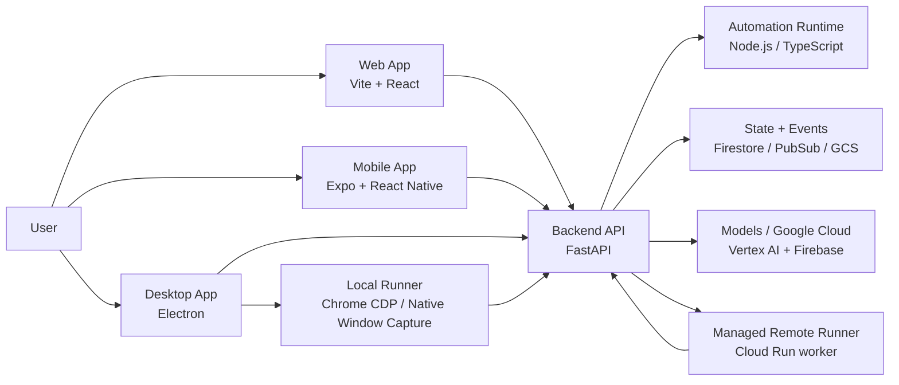
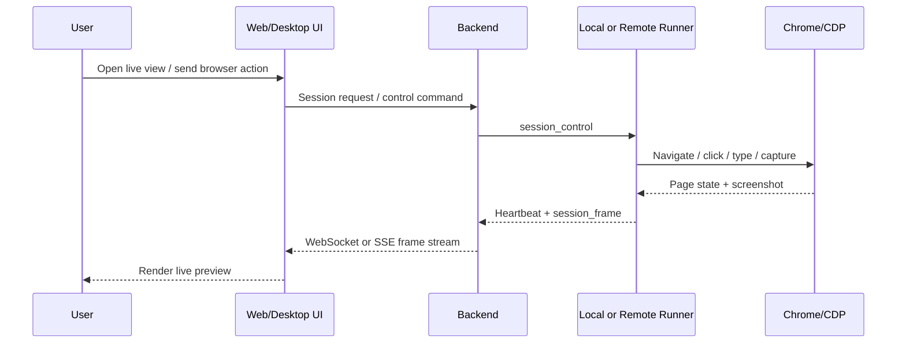
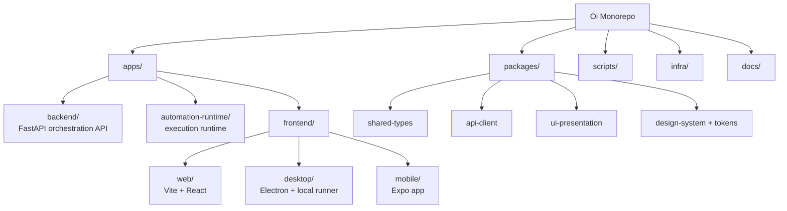
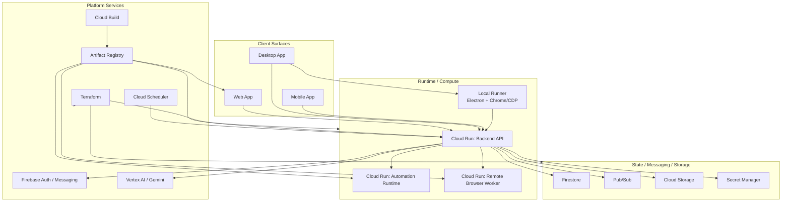
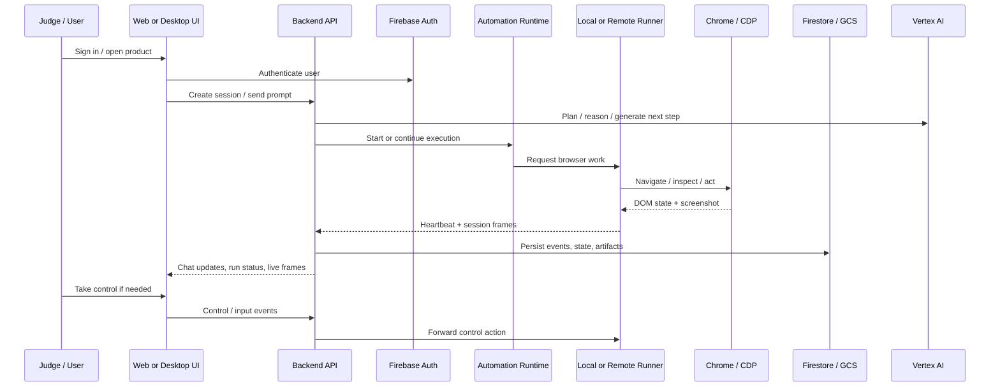

# Oi

Oi is a multimodal AI operator that combines chat, voice, browser control, scheduling, and human-in-the-loop execution in one system.

Live application: [https://oye-web-prod-zztfzquboa-uc.a.run.app](https://oye-web-prod-zztfzquboa-uc.a.run.app)

The repository contains the full product stack:
- a FastAPI backend for orchestration, auth, browser-session control, and automation APIs
- a dedicated automation runtime for long-running execution
- a Vite web app for chat, sessions, and device control
- an Electron desktop app that can attach a local browser runner
- a React Native mobile app

## What Oi Does

- Chat with an AI assistant using text, voice, images, files, and live browser context
- Run browser tasks locally or on managed remote runners
- Stream browser frames into the UI for monitoring and takeover
- Support human control handoff during automation
- Schedule and track long-running automation sessions
- Share types and API clients across web, mobile, and desktop surfaces

## Architecture

### System Overview



### Browser Session Flow



### Repository Layout



### Technical Deployment Architecture



### End-to-End Product Flow



### Cloud Services Used

These are the main external and infrastructure services used in this project.

| Service | Where It Fits |
| --- | --- |
| Cloud Run | Hosts the backend API, automation runtime, web frontend, and remote browser worker |
| Vertex AI | Powers Gemini-based planning, multimodal reasoning, and live model integrations |
| Firebase Auth | User authentication for product surfaces |
| Firebase Messaging | Device and notification plumbing for mobile / multi-device flows |
| Firestore | User-scoped state, device/session ownership, and operational data |
| Cloud Pub/Sub | Task and automation event fanout |
| Cloud Scheduler | Scheduled wake-ups / periodic task triggering |
| Cloud Storage | Uploaded files, screenshots, and other durable artifacts |
| Secret Manager | Sensitive runtime configuration |
| Artifact Registry | Docker image storage |
| Cloud Build | Container image build pipeline |
| Terraform | Infrastructure provisioning |
| Chrome DevTools Protocol | Browser automation and frame capture |
| Electron | Desktop shell and local browser runner |

### Technical Highlights

Some of the most important design choices in this system are:

- separation between orchestration (`backend`) and execution (`automation-runtime`)
- support for both local-runner and remote-runner browser execution models
- a live session transport path from runner to backend to web/desktop UI
- human takeover and control handoff for browser sessions
- shared types and client contracts across web, desktop, and mobile surfaces
- use of managed cloud services instead of pushing all responsibilities into one monolith

## Demo Checklist

If you are evaluating Oi for a demo, judge review, or hackathon submission, these are the highest-signal flows to test:

1. Open the live application and start a new conversation
2. Send a text prompt that triggers a browser or automation task
3. Open the desktop app and confirm a local runner appears in the Sessions view
4. Turn on live view and verify browser frames stream into the UI
5. Take control of the browser session and perform at least one action
6. Test a multimodal path such as voice, file upload, or image-assisted chat
7. Verify the system can move between autonomous execution and human takeover

## Tech Stack

- Backend: Python, FastAPI, Pydantic, Google Cloud integrations
- Runtime: Node.js, TypeScript
- Web: React, Vite, TanStack Query, Firebase Auth
- Desktop: Electron
- Mobile: Expo, React Native
- Browser automation: Chrome DevTools Protocol, `agent-browser`
- Infra: Cloud Run, Artifact Registry, Cloud Build, Terraform

## Monorepo Structure

```text
apps/
  automation-runtime/   Long-running runtime and execution worker
  backend/              FastAPI API, auth, browser sessions, automation orchestration
  frontend/
    desktop/            Electron shell and local runner
    mobile/             Expo / React Native client
    web/                Vite / React web app

packages/
  api-client/           Shared API client
  design-system-*/      Shared design system packages
  design-tokens/        Shared tokens
  shared-types/         Shared domain and transport types
  ui-presentation/      Shared presentation utilities

scripts/                Dev, CI, build, release, deploy helpers
infra/terraform/        Infrastructure definitions
docs/                   Architecture notes, rollout docs, design notes
```

## Environment Notes

- Backend configuration lives in `apps/backend/.env`
- Non-production backend loads dotenv files automatically
- Frontend production builds require Firebase and API URL build args
- Local desktop runner needs a backend runner secret and either a Chrome path or a CDP URL

## Deployment

Production and staging deploy scripts are included:

```bash
pnpm deploy:stack:staging
pnpm deploy:stack:prod
```

Image-only build helpers:

```bash
pnpm build:remote-images
pnpm build:remote-backend
pnpm build:automation-runtime-image
pnpm build:frontend-image
```

The production stack is designed around Cloud Run services for:

- backend API
- automation runtime
- web frontend
- remote browser worker

## Known Limitations

- Some local flows depend on Google Cloud credentials and Firebase configuration.
- If common dev ports are already occupied, helper scripts may choose fallback ports.
- Browser-session behavior is best when the desktop app and local runner are both active.
- Certain mobile or cloud-runner paths may require additional environment setup beyond the core web demo.
- Large frontend bundles currently trigger Vite chunk-size warnings during production builds.

## Security and Repo Hygiene

- staged secret scanning hook is available via `.githooks/`
- auth uses Firebase-backed session flows for product surfaces
- runner registration is protected with shared secrets
- local and remote browser sessions are isolated behind explicit control routes

To enable the staged secret scanner:

```bash
git config core.hooksPath .githooks
```

Manual scan:

```bash
./scripts/scan-staged-secrets.sh
```

## Hackathon Judge Quickstart

If you only want to run the product locally for evaluation, use this path.

### 1. Install dependencies

```bash
pnpm install
make -C apps/backend bootstrap
```

### 2. Verify your machine

```bash
bash ./scripts/doctor.sh
```

This checks for the core tools used by the project:
- `node`
- `pnpm`
- `python3`
- `gcloud`
- `terraform`
- `make`

### 3. Start the core demo services

Open three terminals and run:

```bash
pnpm dev:backend
```

```bash
pnpm dev:automation-runtime
```

```bash
pnpm dev:web
```

### 4. Open the product

Once those services are running, open the web app in your browser.

Typical local URLs:
- web: `http://127.0.0.1:3000` or the Vite URL printed in the terminal
- backend: `http://127.0.0.1:8080`
- automation runtime: `http://127.0.0.1:8787`

### 5. Optional: start the desktop app and local runner

If you want to test local browser control and live browser preview:

```bash
pnpm dev:desktop
```

The desktop app is the easiest way to evaluate:
- local runner registration
- live browser frame streaming
- human takeover of a browser session

### 6. Optional: start mobile

```bash
pnpm dev:mobile
```

### Judge Notes

- The backend bootstrap step creates a dev `.env` automatically if one does not exist.
- Local development is designed to run in `ENV=dev`.
- Some flows require Google Cloud credentials because the backend and runtime integrate with Google services.
- If a preferred local port is busy, the web/mobile helper may fall back to a nearby free port and print it in the terminal.
- The browser-session experience is best tested with the desktop app running.

## Local Development

### Prerequisites

- Node.js 20+
- `pnpm` 9+
- Python 3.11+
- `gcloud`
- Application Default Credentials for Google Cloud

### Bootstrap

```bash
pnpm install
bash ./scripts/doctor.sh
make -C apps/backend bootstrap
gcloud auth application-default login
```

### Start Services

```bash
pnpm dev:backend
pnpm dev:automation-runtime
pnpm dev:web
pnpm dev:desktop
pnpm dev:mobile
```

The helper scripts will try to assign local ports automatically. In practice, the main dev services are typically:

- backend: `http://127.0.0.1:8080`
- automation runtime: `http://127.0.0.1:8787`
- web: `http://127.0.0.1:3000` or Vite default fallback

### Useful Commands

```bash
pnpm check
pnpm lint:all
pnpm typecheck:all
pnpm test:all
pnpm release:preflight
```

## Where To Start

- Start with `apps/backend` if you want the main API and orchestration layer
- Start with `apps/frontend/web` if you want the primary product UI
- Start with `apps/frontend/desktop` if you want local runner and browser-control flows
- Start with `apps/automation-runtime` if you want execution/runtime behavior

## License

Licensed under the Apache License 2.0. See `LICENSE`.
