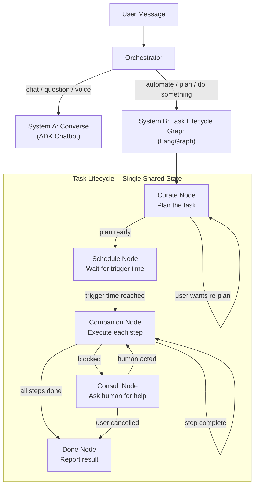
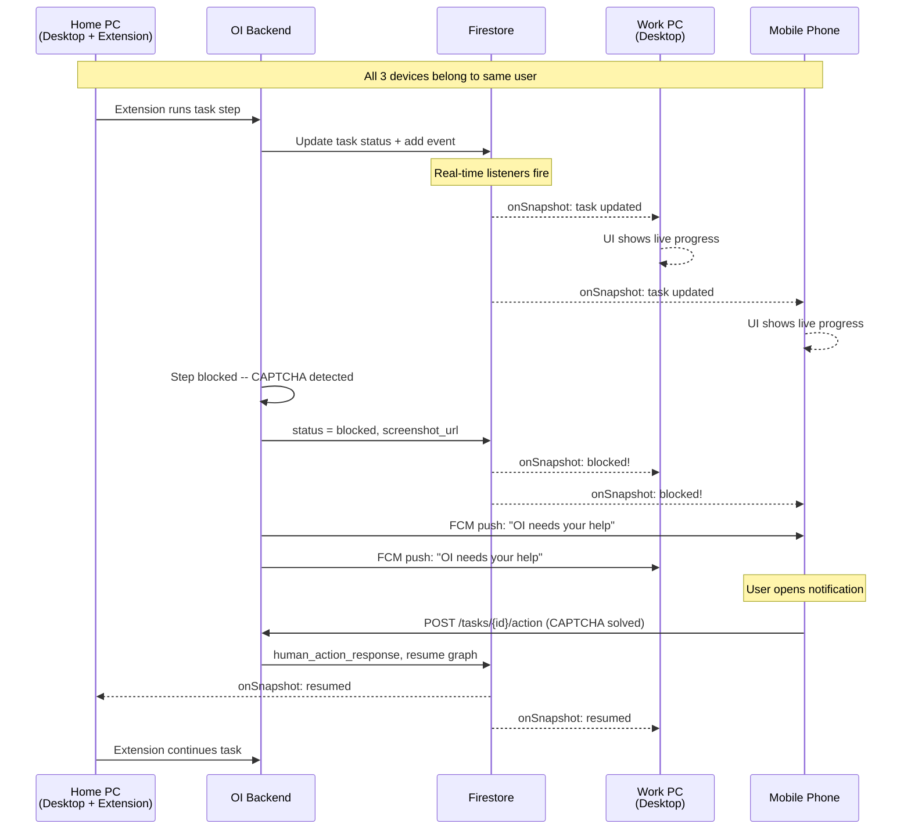
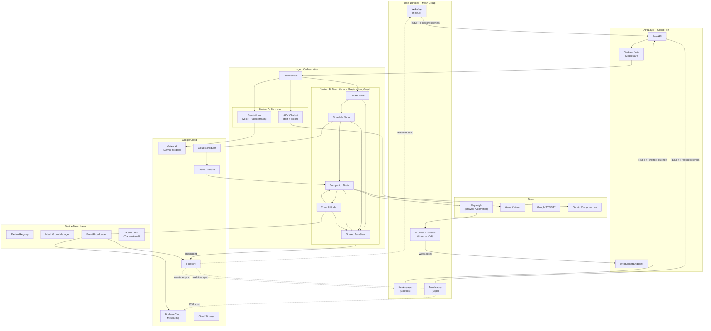
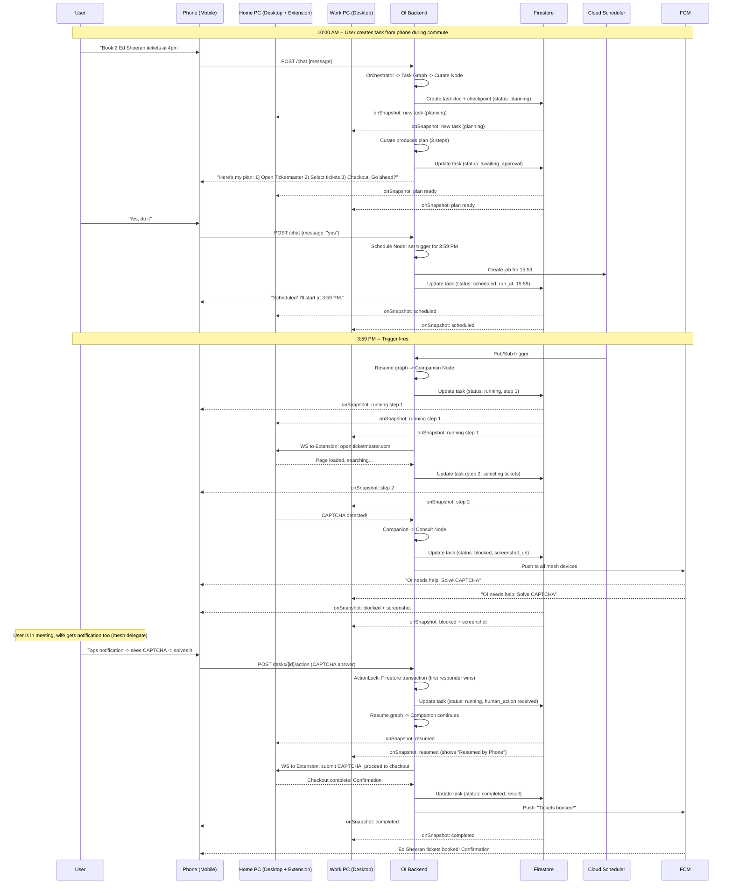

# OI -- Refined Architecture and Execution Plan (v2)

This plan supersedes v1. Key changes from the previous plan:

- Curate, Companion, and Consult are **nodes in a single LangGraph state machine**, not separate modules
- UX is **Chat + Tasks** (not four equal tabs) -- users are non-technical
- Device mesh is a first-class architectural concern with real-time sync
- Firestore real-time listeners replace most custom WebSocket broadcasting

---

## 1. The Core Mental Model

OI has exactly **two agent systems** that work independently:

**System A: Converse** -- A standalone multimodal chatbot. Text, voice, images, camera, documents. No task state. Stateless conversations (with session memory). This is the Google ADK chatbot, already scaffolded in [src/oi_agent/agents/adk_chatbot.py](src/oi_agent/agents/adk_chatbot.py).

**System B: Task Lifecycle Graph** -- A single LangGraph state machine where Curate, Companion, and Consult are nodes. They share one `TaskState`. The graph has checkpoints persisted to Firestore so it can pause (wait for schedule, wait for human) and resume across hours or days.

The **Orchestrator** ([src/oi_agent/agents/orchestrator.py](src/oi_agent/agents/orchestrator.py)) decides which system to route to. If the user says "what's the weather?" it goes to Converse. If the user says "book Ed Sheeran tickets at 4pm" it enters the Task Lifecycle Graph.



---

## 2. The Shared TaskState (Heart of the System)

All three agents (Curate, Companion, Consult) read and write to the same state object. This is a LangGraph `TypedDict` with annotated reducers:

```python
from typing import Annotated, Literal, TypedDict
from langgraph.graph import add_messages

class TaskStep(TypedDict):
    index: int
    description: str
    action_type: Literal["api_call", "browser_action", "human_decision"]
    target_url: str | None
    status: Literal["pending", "running", "done", "failed", "blocked"]
    result: str | None

class TaskState(TypedDict):
    # Identity -- set once at creation
    task_id: str
    user_id: str
    mesh_group_id: str
    created_by_device_id: str

    # Shared conversation context -- all 3 agents append to this
    messages: Annotated[list, add_messages]

    # Curate populates these
    plan_description: str
    steps: list[TaskStep]
    scheduled_at: str | None          # ISO timestamp or None for immediate

    # Companion updates these
    current_step_index: int
    status: Literal[
        "planning", "awaiting_approval", "scheduled",
        "running", "blocked", "completed", "failed", "cancelled"
    ]

    # Consult populates these when human acts
    blocked_reason: str | None
    blocked_screenshot_url: str | None
    human_action_response: str | None
    human_action_device_id: str | None
```

**How this flows:**

1. Curate node receives user request in `messages`, produces `plan_description` + `steps`, sets `status = "awaiting_approval"`
2. User approves (or OI auto-approves simple plans). Schedule node sets `status = "scheduled"` and waits.
3. At trigger time, Companion node picks up, iterates through `steps`, updates `current_step_index` and each step's `status`
4. If a step hits a blocker (CAPTCHA, decision needed), Companion sets `status = "blocked"`, `blocked_reason`, `blocked_screenshot_url`
5. LangGraph checkpoints the state to Firestore and suspends (using `interrupt`)
6. Consult broadcasts "action needed" to all devices in the mesh
7. A human responds from any device. `human_action_response` is written. Graph resumes.
8. Companion reads the human action, continues from where it left off.

---

## 3. Device Mesh Architecture

This is the most architecturally distinct part of OI. Every user has a **device group**. Multiple users can form a **mesh group** for shared task delegation.

### 3a. Mesh Data Model (Firestore)

```
Firestore Collections:

users/{user_id}
  ├── email, display_name, created_at
  └── devices/{device_id}
        ├── device_type: "web" | "mobile" | "desktop" | "extension"
        ├── device_name: "Yandrapue's MacBook Pro"
        ├── fcm_token: string (for push notifications)
        ├── is_online: boolean
        └── last_seen: timestamp

mesh_groups/{group_id}
  ├── owner_user_id: string
  ├── members: [
  │     { user_id, role: "owner" | "delegate", added_at }
  │   ]
  └── name: "Family" | "Work" | etc.

tasks/{task_id}
  ├── mesh_group_id: string
  ├── created_by: { user_id, device_id }
  ├── graph_checkpoint: binary (LangGraph serialized state)
  ├── status: string (denormalized from graph state for queries)
  ├── created_at, updated_at: timestamp
  └── events/{event_id}  (subcollection -- timeline)
        ├── type: "created" | "planned" | "approved" | "scheduled" |
        │         "step_started" | "step_completed" | "blocked" |
        │         "human_acted" | "completed" | "failed" | "cancelled"
        ├── timestamp
        ├── device_id (which device triggered this event)
        ├── user_id (which user triggered this event)
        └── payload: map (event-specific data)

conversations/{session_id}
  ├── user_id
  ├── messages: array
  └── created_at, updated_at
```

### 3b. How Devices Stay in Sync



**Three communication channels, each with a purpose:**

- **Firestore real-time listeners** -- Primary sync mechanism. All clients (web, mobile, desktop) subscribe to task documents. When the backend updates a task, every device sees it instantly. This handles 90% of sync.
- **FCM push notifications** -- Wakes up mobile apps that are backgrounded/closed. The user taps the notification and goes straight to the blocked task.
- **WebSocket** -- Used ONLY for streaming (live voice, live video, Gemini Live bidirectional audio) and for the browser extension (which cannot use Firestore listeners). Not used for task sync.

### 3c. Action Locking (Prevent Double-Action)

When a task is blocked and waiting for human input, multiple devices see the "Action Needed" prompt. To prevent two users/devices from responding simultaneously:

```python
# In the Consult node: Firestore transaction ensures exactly one response
@firestore.transactional
def submit_human_action(transaction, task_ref, action, device_id, user_id):
    task = task_ref.get(transaction=transaction)
    if task.get("status") != "blocked":
        raise AlreadyHandledError("Another device already responded")
    transaction.update(task_ref, {
        "graph_state.human_action_response": action,
        "graph_state.human_action_device_id": device_id,
        "status": "running",
    })
```

All other devices see the status change to "running" via their real-time listener and their UI updates to show "Resumed by [device name]".

---

## 4. UX Architecture (Non-Technical Users)

Users never see "Curate", "Companion", or "Consult" as labels. The app has two primary views:

### App Navigation

```
Bottom Tab Bar (Mobile) / Sidebar (Web + Desktop):
  [Chat]     -- Converse. Talk to OI.
  [Tasks]    -- See all tasks, their plans, progress, and history.
  [Settings] -- Devices, mesh groups, preferences.

Plus:
  [Action Needed Badge] -- Red badge on Tasks tab when any task is blocked.
  [Push Notification]   -- "OI needs your help with: Book Ed Sheeran tickets"
                           Taps directly to the blocked task in Tasks view.
```

### How the User Experiences It

1. User opens Chat, says: "Book 2 Ed Sheeran concert tickets at 4pm today"
2. OI responds IN THE CHAT: "Got it. Here's my plan: 1) Open Ticketmaster at 3:59pm 2) Search for Ed Sheeran 3) Select 2 best available tickets 4) Proceed to checkout. Should I go ahead?"
3. User says "Yes" in the chat.
4. A new task card appears in the Tasks view. Status: "Scheduled for 4:00 PM". The Chat shows: "All set! I'll start at 4pm. You can track progress in Tasks."
5. At 4pm, the task card updates live: "Running -- Step 1: Opening Ticketmaster..."
6. If blocked: Push notification arrives. User taps it. Task card shows the CAPTCHA image with a "Solve and Continue" button.
7. User solves it. Task resumes. "Step 3: Selecting tickets..."
8. Task completes. "Booked! 2 tickets, Section A, Row 12. Confirmation #XYZ."

The **transition from Chat to Task is seamless** -- it happens in the same conversation. The Task view is just a dashboard for monitoring and acting.

---

## 5. Backend Architecture (Refined)

### Directory Structure (within `apps/backend/src/oi_agent/`)

```
oi_agent/
├── __init__.py
├── main.py                          # FastAPI app entry
├── config.py                        # Pydantic settings (exists)
│
├── api/
│   ├── routes.py                    # REST endpoints (exists, to be expanded)
│   ├── websocket.py                 # WS for voice streaming + extension
│   └── middleware.py                # Auth, CORS, rate-limit, correlation IDs
│
├── agents/
│   ├── orchestrator.py              # Routes Chat vs Task (exists, to be expanded)
│   │
│   ├── converse/                    # System A: Standalone chatbot
│   │   ├── chatbot.py              # ADK text chat (from existing adk_chatbot.py)
│   │   └── live_stream.py          # Gemini Live bidirectional voice/video
│   │
│   └── task_graph/                  # System B: Single LangGraph -- Curate+Companion+Consult
│       ├── graph.py                 # Graph definition: nodes, edges, compile
│       ├── state.py                 # TaskState TypedDict (shared by all nodes)
│       ├── checkpointer.py          # Firestore-backed LangGraph checkpoint saver
│       └── nodes/
│           ├── curate.py            # Plan decomposition node
│           ├── schedule.py          # Wait-for-trigger node
│           ├── companion.py         # Step execution node
│           └── consult.py           # Human-in-the-loop interrupt node
│
├── tools/
│   ├── registry.py                  # Tool registry (exists)
│   ├── browser_automation.py        # Playwright headless
│   ├── computer_use.py              # Gemini Computer Use (exists)
│   ├── vision.py                    # Image/camera analysis via Gemini Vision
│   ├── voice.py                     # Google Cloud TTS + STT
│   └── google_cloud.py             # GCP context helper (exists)
│
├── mesh/
│   ├── device_registry.py           # Register/unregister devices, FCM tokens
│   ├── group_manager.py             # Create/manage mesh groups, invite users
│   ├── broadcaster.py               # Broadcast task events to all mesh devices
│   └── action_lock.py              # Firestore transactional locking for Consult
│
├── auth/
│   ├── firebase_auth.py             # Verify Firebase ID tokens
│   └── permissions.py              # Mesh-aware authorization (can user X act on task Y?)
│
├── memory/
│   ├── store.py                     # Abstract interface (exists)
│   ├── firestore_store.py           # Firestore implementation
│   └── models.py                    # Pydantic data models for Firestore documents
│
├── prompts/loader.py                # (exists)
├── skills/loader.py                 # (exists)
└── observability/telemetry.py       # (exists)
```

### The Task Graph in Detail (graph.py)

```python
from langgraph.graph import StateGraph, END
from oi_agent.agents.task_graph.state import TaskState
from oi_agent.agents.task_graph.nodes import curate, schedule, companion, consult

def build_task_graph() -> StateGraph:
    graph = StateGraph(TaskState)

    graph.add_node("curate", curate.run)
    graph.add_node("schedule", schedule.run)
    graph.add_node("companion", companion.run)
    graph.add_node("consult", consult.run)

    graph.set_entry_point("curate")

    graph.add_edge("curate", "schedule")

    graph.add_conditional_edges("schedule", schedule.route, {
        "execute": "companion",
        "wait": END,          # checkpoint + resume via Cloud Scheduler
    })

    graph.add_conditional_edges("companion", companion.route, {
        "next_step": "companion",  # loop: execute next step
        "blocked": "consult",       # needs human
        "done": END,
        "failed": END,
    })

    graph.add_conditional_edges("consult", consult.route, {
        "resume": "companion",     # human acted, continue
        "re_plan": "curate",       # human wants a different plan
        "cancel": END,
    })

    return graph

# Compiled with Firestore checkpointer for persistence
task_graph = build_task_graph().compile(
    checkpointer=FirestoreCheckpointer()
)
```

---

## 6. System Architecture Diagram (Complete)



---

## 7. Real-Time Sync: The Ed Sheeran Ticket Example (Full Flow)



---

## 8. Monorepo Structure (Updated)

```
Oi/
├── apps/
│   ├── backend/                     # Python -- FastAPI + ADK + LangGraph
│   │   ├── src/oi_agent/            # (structure from Section 5)
│   │   ├── tests/
│   │   ├── prompts/
│   │   ├── skills/
│   │   ├── configs/
│   │   ├── requirements.txt
│   │   ├── pyproject.toml
│   │   ├── Makefile
│   │   └── Dockerfile
│   │
│   ├── web/                         # Next.js -- Landing + Dashboard
│   │   ├── src/app/
│   │   │   ├── layout.tsx
│   │   │   ├── page.tsx             # Landing / download page
│   │   │   └── (app)/
│   │   │       ├── layout.tsx       # App shell: sidebar with Chat, Tasks, Settings
│   │   │       ├── chat/page.tsx    # Converse
│   │   │       ├── tasks/
│   │   │       │   ├── page.tsx     # Task list dashboard
│   │   │       │   └── [id]/page.tsx # Single task detail + action
│   │   │       └── settings/
│   │   │           ├── page.tsx
│   │   │           ├── devices/page.tsx
│   │   │           └── mesh/page.tsx
│   │   ├── src/components/
│   │   ├── src/features/
│   │   ├── src/hooks/
│   │   ├── src/services/
│   │   ├── package.json
│   │   └── tailwind.config.ts
│   │
│   ├── mobile/                      # React Native Expo
│   │   ├── app/
│   │   │   ├── _layout.tsx
│   │   │   ├── (auth)/
│   │   │   │   ├── login.tsx
│   │   │   │   └── register.tsx
│   │   │   └── (tabs)/
│   │   │       ├── _layout.tsx      # Tab bar: Chat, Tasks, Settings
│   │   │       ├── chat.tsx
│   │   │       ├── tasks/
│   │   │       │   ├── index.tsx    # Task list
│   │   │       │   └── [id].tsx     # Task detail + action
│   │   │       └── settings.tsx
│   │   ├── src/
│   │   └── package.json
│   │
│   ├── desktop/                     # Electron shell
│   │   ├── src/main/
│   │   ├── package.json
│   │   └── electron-builder.yml
│   │
│   └── extension/                   # Chrome MV3
│       ├── src/
│       │   ├── background/          # WS connection to backend, task execution
│       │   ├── content/             # DOM interaction scripts
│       │   └── popup/               # Mini task status UI
│       ├── manifest.json
│       └── package.json
│
├── packages/
│   ├── shared-types/                # @oi/shared-types
│   │   └── src/
│   │       ├── api.ts               # REST request/response types
│   │       ├── task.ts              # TaskState, TaskStep, TaskEvent
│   │       ├── mesh.ts              # MeshGroup, Device, Member
│   │       ├── chat.ts              # Message, Conversation
│   │       └── websocket.ts         # WS frame types
│   ├── api-client/                  # @oi/api-client
│   │   └── src/
│   │       ├── http.ts              # REST client (shared across all apps)
│   │       ├── firestore.ts         # Firestore listener helpers
│   │       └── ws.ts               # WebSocket client (voice + extension)
│   └── theme/                       # @oi/theme
│       └── src/
│           ├── colors.ts            # #751636, #33101c, whites, blacks
│           ├── typography.ts
│           └── spacing.ts
│
├── infra/terraform/
├── .github/workflows/
├── docs/
├── scripts/
├── pnpm-workspace.yaml
├── package.json
└── README.md
```

---

## 9. Technology Stack (Same as v1, with additions)

### Backend (Python)

- FastAPI, Uvicorn/Gunicorn, Pydantic v2
- Google ADK 1.0+, LangChain 0.3+, **LangGraph 0.2+** (the centerpiece)
- Gemini 2.5 Flash (text), Gemini 2.0 Flash Live (streaming), Gemini Vision
- **Playwright** (browser automation in Companion node)
- Google Cloud TTS + STT (OI's voice)
- **Firebase Admin SDK** (auth, Firestore, FCM)
- Firestore (persistence, real-time sync, graph checkpoints)
- Cloud Pub/Sub + Cloud Scheduler (timed task triggers)
- Cloud Storage (uploads, screenshots)
- structlog + OpenTelemetry (observability)

### Frontend Web (TypeScript)

- Next.js 14+ (App Router), Tailwind CSS v4 (maroon theme)
- TanStack Query (server state), Zustand (client state)
- **Firebase JS SDK** (Auth + Firestore real-time listeners)
- WebSocket (voice streaming only)

### Mobile (TypeScript)

- Expo SDK 51+, Expo Router
- TanStack Query + Zustand
- **React Native Firebase** (Auth + Firestore + Cloud Messaging)
- expo-camera, expo-av, expo-notifications

### Desktop

- Electron 30+ wrapping the Next.js web frontend
- System tray, native notifications, screen capture

### Browser Extension

- Chrome MV3, WebSocket to backend, DOM content scripts, Tab Groups API

### Infrastructure

- GCP: Cloud Run, Firestore, Pub/Sub, Scheduler, Storage, FCM, Secret Manager
- Terraform for IaC, GitHub Actions for CI/CD

---

## 10. All Configurations Needed

### Backend `.env`

```
ENV=dev
APP_NAME=oi-agent
APP_HOST=0.0.0.0
APP_PORT=8080
LOG_LEVEL=INFO

GOOGLE_CLOUD_PROJECT=your-project-id
GOOGLE_CLOUD_LOCATION=us-central1
GOOGLE_GENAI_USE_VERTEXAI=true
GOOGLE_APPLICATION_CREDENTIALS=

GEMINI_MODEL=gemini-2.5-flash
GEMINI_LIVE_MODEL=gemini-2.0-flash-live-001
ADK_APP_NAME=oi-adk-chatbot

FIREBASE_PROJECT_ID=your-project-id
FIRESTORE_DATABASE=(default)

PUBSUB_TOPIC_TASKS=oi-tasks
PUBSUB_SUBSCRIPTION_TASKS=oi-tasks-sub
GCS_BUCKET_UPLOADS=oi-uploads

TTS_LANGUAGE_CODE=en-US
TTS_VOICE_NAME=en-US-Neural2-D

ENABLE_LIVE_STREAMING=true
ENABLE_COMPUTER_USE=false
ENABLE_VISION_TOOLS=true
ENABLE_BROWSER_AUTOMATION=false

ALLOWED_ORIGINS=http://localhost:3000,http://localhost:8081
REQUEST_TIMEOUT_SECONDS=30
MAX_TOOL_CALLS_PER_REQUEST=10
```

### Web `.env.local`

```
NEXT_PUBLIC_API_URL=http://localhost:8080
NEXT_PUBLIC_WS_URL=ws://localhost:8080/ws
NEXT_PUBLIC_FIREBASE_API_KEY=
NEXT_PUBLIC_FIREBASE_AUTH_DOMAIN=
NEXT_PUBLIC_FIREBASE_PROJECT_ID=
```

### Mobile `.env`

```
API_URL=http://localhost:8080
WS_URL=ws://localhost:8080/ws
FIREBASE_API_KEY=
FIREBASE_AUTH_DOMAIN=
FIREBASE_PROJECT_ID=
```

### GCP Resources (Terraform)

- Cloud Run: `oi-backend`
- Firestore: `(default)` with collections: `users`, `mesh_groups`, `tasks`, `conversations`
- Pub/Sub: topic `oi-tasks`, subscription `oi-tasks-sub`
- Cloud Scheduler: jobs created dynamically per task
- Cloud Storage: `oi-uploads`
- Firebase: Auth (email + Google), Cloud Messaging, Hosting
- Artifact Registry: `oi-images`
- Secret Manager: all sensitive env vars

---

## 11. CI/CD (Same as v1)

- **Every PR:** lint + typecheck + unit tests + build check (path-filtered per app)
- **Merge to main:** Docker build -> deploy staging -> integration tests -> manual gate to prod
- **Git tag:** EAS Build (mobile), electron-builder (desktop), Chrome Web Store (extension)
- **Secrets:** GitHub Actions Secrets + GCP Workload Identity Federation

---

## 12. Build Order (Revised Phases)

**Phase 1 -- Foundation + Converse (Weeks 1-3)**

- Restructure monorepo (move existing code into `apps/backend/`)
- Shared packages: `@oi/shared-types`, `@oi/api-client`, `@oi/theme`
- Backend: Firebase Auth middleware, Firestore store, expand existing chatbot
- Web: Next.js app with landing page + Chat view (Converse only)
- CI/CD: backend + web pipelines

**Phase 2 -- Multimodal + Mobile + Desktop (Weeks 4-6)**

- Backend: Voice (TTS/STT), Vision, Gemini Live streaming
- Web: Voice input/output, image upload, camera, screen share
- Mobile: Expo scaffold, Chat tab with voice + camera
- Desktop: Electron shell loading web frontend

**Phase 3 -- Task Lifecycle Graph (Weeks 7-10)**

- Backend: Build the LangGraph state machine (Curate + Companion + Consult nodes)
- Backend: Firestore checkpointer for graph persistence
- Backend: Cloud Scheduler + Pub/Sub integration for timed tasks
- Backend: Playwright browser automation tool
- Extension: Chrome extension with tab grouping + DOM interaction
- Web + Mobile: Tasks view (create plan, monitor progress, act on blocks)

**Phase 4 -- Device Mesh (Weeks 11-13)**

- Backend: Device registry, mesh group manager, event broadcaster
- Backend: Action locking (Firestore transactions)
- Backend: FCM push notification dispatch
- All clients: Firestore real-time listeners for task sync
- Mobile: Push notification handling, deep link to blocked task
- Web + Mobile: Settings view (devices, mesh groups, invitations)

**Phase 5 -- Polish + Production (Weeks 14-16)**

- Production checklist (see `docs/PRODUCTION_CHECKLIST.md`)
- E2E testing across all platforms and mesh scenarios
- Security audit (mesh authorization, action delegation)
- Performance: concurrent tasks, mesh with 5+ devices
- App store submissions, desktop builds, extension submission

---

## 13. Key Risks and Mitigations

- **LangGraph checkpointing to Firestore:** LangGraph has built-in MemorySaver but no Firestore saver. We need to write `FirestoreCheckpointer` implementing the `BaseCheckpointSaver` interface. This is straightforward but must be tested for serialization edge cases.
- **Browser automation blocked by bot detection:** Playwright can be fingerprinted. Mitigation: (1) use stealth plugins, (2) fall back to Gemini Computer Use which operates via screenshots, (3) always have Consult as the safety net.
- **Real-time sync latency:** Firestore listeners are fast (sub-second in same region) but add ~100-300ms. For the Task view this is fine. For voice streaming, we use WebSocket (not Firestore).
- **Mesh security:** A delegate user can act on tasks they're invited to. Every action is logged with `user_id` + `device_id`. Mesh owners can revoke delegates instantly. Firestore security rules enforce read/write scoping.
- **Graph resumption after hours/days:** LangGraph checkpoints are durable. The Cloud Scheduler fires a Pub/Sub message which triggers a Cloud Run instance that loads the checkpoint and resumes. Stateless compute, stateful graph.

---

## 14. Code Philosophy

- Every module has a single responsibility with a name that tells you what it does
- Functions are short (under 30 lines), with descriptive names that read as sentences
- Type hints on everything -- types are the documentation
- No abbreviations in variable names (`notification` not `notif`, `scheduler` not `sched`)
- Constants at the top, private helpers at the bottom, public API in the middle
- Every file follows: imports -> constants -> types -> public functions -> private helpers
- Tests mirror the source tree and read as behavior specifications
- The LangGraph nodes are pure functions: `(TaskState) -> dict` -- easy to test in isolation
